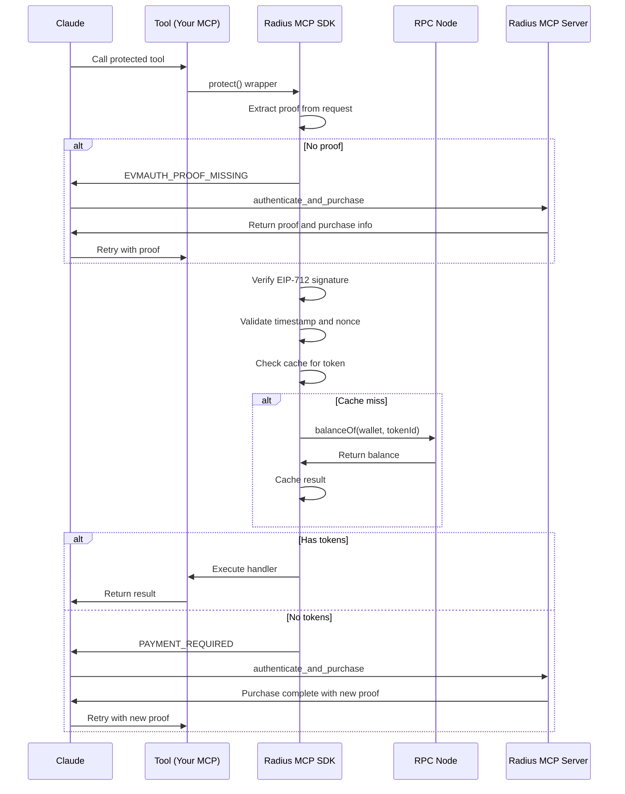

# Radius MCP SDK

[](https://www.npmjs.com/package/@radiustechsystems/mcp-sdk)
[](https://opensource.org/licenses/MIT)

Token-gate your MCP tools, resources, and prompts with just 3 lines of code. Works seamlessly with the **Radius MCP Server** to enable decentralized, token-based access control across the MCP ecosystem.

> **TESTNET RELEASE**  
> This SDK is currently configured for use with Radius Testnet.

## Overview

The Radius MCP SDK is the authorization component of the Radius ecosystem. It allows MCP server developers to protect their tools, resources, and prompts with ERC-1155 token requirements. The SDK verifies cryptographic proofs generated by the Radius MCP Server and checks on-chain token ownership, enabling a decentralized marketplace of token-gated AI tools.

### How It Works

1. **Simple Integration**: Add SDK to your MCP server with 3 lines of code
2. **Proof Verification**: SDK validates EIP-712 signatures from the Radius MCP Server
3. **Token Checking**: Direct on-chain verification of token ownership
4. **Intelligent Errors**: Guides Claude through authentication and purchase flow
5. **Performance**: Built-in caching and request deduplication

## Installation

```bash
pnpm add @radiustechsystems/mcp-sdk
# or
npm install @radiustechsystems/mcp-sdk
# or
yarn add @radiustechsystems/mcp-sdk
```

## Features

- **🔐 Cryptographic Security**: EIP-712 signature verification
- **🧠 AI-Friendly**: Structured error responses that guide Claude through the flow
- **📝 TypeScript First**: Full type safety with comprehensive interfaces
- **🛡️ Security Enhanced**: Chain ID validation and replay protection
- **⚡ High Performance**: Built-in caching and request deduplication
- **🎯 Simple Integration**: Just 3 lines of code to protect any MCP tool

## Quick Start

```typescript
import { RadiusMcpSdk } from '@radiustechsystems/mcp-sdk';

// Simple usage - just provide the contract address!
// Defaults to Radius Testnet (chainId: 1223953)
const radius = new RadiusMcpSdk({
  contractAddress: '0x5448Dc20ad9e0cDb5Dd0db25e814545d1aa08D96'
});

// Protect any MCP tool, resource, or prompt
handler: radius.protect(TOKEN_ID, yourHandler)
```

## Working Example

Check out the [`/examples/fastmcp`](./examples/fastmcp) directory for a complete working example that you can run in under 60 seconds!

## Dependencies

The SDK has minimal dependencies:

- `viem` - For Ethereum interactions and EIP-712 signature verification
- `@evmauth/eip712-authn` - For EIP-712 authentication handling

## Complete Usage Example

### How It Works: The 3-Call Flow

```typescript
// 1. Claude tries to use your protected tool
await yourTool({ query: "analyze market data" });
// Response: EVMAUTH_PROOF_MISSING error with required tokens

// 2. Claude calls Radius MCP Server (handles everything in one call!)
const response = await authenticate_and_purchase({ 
  tokenIds: [101]  // From error's requiredTokens field
});
// Returns: { proof, purchases } - proof for auth + purchase info (if tokens were bought)

// 3. Claude retries with authentication proof
const result = await yourTool({ 
  query: "analyze market data",
  __evmauth: response.proof  // Proof from authenticate_and_purchase
});
// Success! Tool executes and returns results
```

### The __evmauth Namespace

The SDK uses a reserved `__evmauth` namespace to:

1. **Keep auth separate**: Authentication data never mixes with business logic
2. **Maintain full security**: EIP-712 signature verification with cryptographic guarantees
3. **Simplify handlers**: Your tool handlers receive clean requests without auth data
4. **Guide Claude**: Clear error messages show exactly how to use the namespace

### From Developer's Perspective

```typescript
// Your entire integration:
const radius = new RadiusMcpSdk({ ...config });

server.addTool({
  name: 'market_analyzer',
  handler: radius.protect(101, async (args) => {
    // Your tool logic here - only runs if user owns token 101
    return analyzeMarket(args.query);
  })
});
```

## Testnet Configuration

```text
Chain ID: 1223953
RPC URL: https://rpc.testnet.radiustech.xyz
```

## Configuration

### Basic Configuration

```typescript
const radius = new RadiusMcpSdk({
  contractAddress: '0x5448Dc20ad9e0cDb5Dd0db25e814545d1aa08D96'
});
```

### Advanced Configuration

```typescript
const radius = new RadiusMcpSdk({
  contractAddress: '0x5448Dc20ad9e0cDb5Dd0db25e814545d1aa08D96',
  chainId: 1223953,
  rpcUrl: 'https://rpc.testnet.radiustech.xyz',
  cache: {
    ttl: 300,           // Cache TTL in seconds
    maxSize: 1000,      // Max cache entries
    disabled: false     // Set true to disable caching
  },
  debug: false          // Enable debug logging
});
```

### Configuration Options

| Option | Type | Default | Description |
|--------|------|---------|-------------|
| `contractAddress` | `string` | Required | ERC-1155 contract address |
| `chainId` | `number` | `1223953` | Blockchain network ID (Radius Testnet) |
| `rpcUrl` | `string` | Radius Testnet RPC | RPC endpoint for ownership checks |
| `cache.ttl` | `number` | `60` | Cache TTL in seconds |
| `cache.maxSize` | `number` | `1000` | Maximum cache entries |
| `cache.disabled` | `boolean` | `false` | Disable caching |
| `debug` | `boolean` | `false` | Enable debug logging |

## Framework Examples

### FastMCP Integration

```typescript
import { FastMCP } from 'fastmcp';
import { RadiusMcpSdk } from '@radiustechsystems/mcp-sdk';
import { z } from 'zod';

// Simple initialization - defaults to Radius Testnet
const radius = new RadiusMcpSdk({
  contractAddress: '0x5448Dc20ad9e0cDb5Dd0db25e814545d1aa08D96'
});

// Or explicitly set chain/RPC for other networks
const radiusCustom = new RadiusMcpSdk({
  contractAddress: '0x5448Dc20ad9e0cDb5Dd0db25e814545d1aa08D96',
  chainId: 1223953,
  rpcUrl: 'https://rpc.testnet.radiustech.xyz'
});

const server = new FastMCP({
  name: 'Premium Analytics',
  version: '1.0.0'
});

// Protected tool
server.addTool({
  name: 'premium_analytics',
  description: 'Advanced market analytics (requires token)',
  inputSchema: z.object({
    market: z.string(),
    timeframe: z.string()
  }),
  handler: radius.protect(101, async (args) => {
    const data = await fetchPremiumData(args.market, args.timeframe);
    return { content: [{ type: 'text', text: JSON.stringify(data) }] };
  })
});

// Protected resource
server.addResource({
  name: 'premium_dataset',
  description: 'Premium market dataset (requires token)',
  handler: radius.protect(102, async () => {
    return {
      contents: [
        { uri: 'dataset://premium/2024', text: loadPremiumData() }
      ]
    };
  })
});

// Protected prompt
server.addPrompt({
  name: 'expert_trading_prompt',
  description: 'Expert trading strategies (requires token)',
  handler: radius.protect(103, async () => {
    return {
      messages: [
        { role: 'system', content: 'You are an expert trader...' },
        { role: 'user', content: 'Analyze this market...' }
      ]
    };
  })
});
```

## Multi-Token Protection

### ANY Token Logic

```typescript
// User needs ANY of these tokens
handler: radius.protect([201, 202, 203], async (args) => {
  // User has at least one of the required tokens
  return performEnterpriseAnalytics(args.query);
})
```

### Specific Token Requirements

```typescript
// Different tools require different tokens
const TOKENS = {
  BASIC_ANALYTICS: 101,
  PREMIUM_ANALYTICS: 102,
  ENTERPRISE_ANALYTICS: [201, 202, 203] // ANY of these
};

// Basic tier
server.addTool({
  name: 'basic_analytics',
  handler: radius.protect(TOKENS.BASIC_ANALYTICS, basicHandler)
});

// Premium tier
server.addTool({
  name: 'premium_analytics',
  handler: radius.protect(TOKENS.PREMIUM_ANALYTICS, premiumHandler)
});

// Enterprise tier
server.addTool({
  name: 'enterprise_analytics',
  handler: radius.protect(TOKENS.ENTERPRISE_ANALYTICS, enterpriseHandler)
});
```

## Universal Adapter Pattern Support

The SDK automatically detects and supports both **FastMCP** and **Standard MCP** patterns, allowing seamless integration regardless of your MCP framework choice.

### Automatic Pattern Detection

The SDK uses multi-signal detection to automatically identify which pattern your handler uses:

```typescript
// FastMCP pattern (2 parameters) - automatically detected
const fastHandler = radius.protect(101, async (request, extra) => {
  const args = request.params?.arguments || {};
  return { content: [{ type: 'text', text: `Result: ${args.query}` }] };
});

// Standard MCP pattern (1 parameter) - automatically detected
const standardHandler = radius.protect(102, async (args) => {
  return { content: [{ type: 'text', text: `Result: ${args.query}` }] };
});
```

### Mixed Pattern Usage

Both patterns can coexist in the same application:

```typescript
const server = new FastMCP({ name: 'Mixed Server' });

// FastMCP tool
server.addTool({
  name: 'fast_tool',
  handler: radius.protect(101, async (request, extra) => {
    const args = request.params?.arguments || {};
    return processFastMCP(args);
  })
});

// Standard MCP tool
server.addTool({
  name: 'standard_tool',
  handler: radius.protect(102, async (args) => {
    return processStandard(args);
  })
});
```

### Explicit Pattern Hints

For edge cases where automatic detection might be ambiguous:

```typescript
// Option 1: Using pattern option
const handler = radius.protect(101, myHandler, { pattern: 'fastmcp' });

// Option 2: Using decorator utilities
import { asFastMCP, asStandard } from '@radiustechsystems/mcp-sdk';

const fastHandler = radius.protect(101, asFastMCP(async (request) => {
  // Explicitly marked as FastMCP
  return handleRequest(request);
}));

const standardHandler = radius.protect(102, asStandard(async (args) => {
  // Explicitly marked as Standard MCP
  return handleArgs(args);
}));
```

### Pattern Detection Features

- **Multi-Signal Analysis**: Combines parameter count, function signature, and request structure analysis
- **Confidence Scoring**: Detection confidence from 0-1 with automatic caching
- **Graceful Fallback**: Automatically tries alternative pattern on mismatch
- **Performance Optimized**: WeakMap caching eliminates repeated detection overhead
- **100% Backward Compatible**: All existing FastMCP code works unchanged

### Why Universal Adapter?

1. **Zero Configuration**: Works automatically without any setup
2. **Framework Agnostic**: Support any MCP implementation pattern
3. **Future Proof**: Adapts to evolving MCP ecosystem
4. **Developer Friendly**: Clean error messages with debugging info
5. **Production Ready**: Robust fallback mechanisms for edge cases

## Integration with the Radius MCP Server

This SDK works in tandem with the **Radius MCP Server** to create a complete token-gating ecosystem:

1. **Radius MCP Server**
   - Handles OAuth authentication with AI clients
   - Manages user wallets via Privy
   - Generates cryptographic proofs
   - Processes token purchases
   - One instance per AI client

2. **Radius MCP SDK** (this repo)
   - Verifies proofs from the Radius MCP Server
   - Checks on-chain token ownership
   - Protects your MCP tools/resources/prompts
   - Guides AI through the flow

## Error Handling

### Error Codes

The SDK uses specific error codes for different failure scenarios:

- `EVMAUTH_PROOF_MISSING` - No proof provided in the request
- `PROOF_EXPIRED` - Proof has expired (proofs expire after 30 seconds by default)
- `PROOF_INVALID` - Proof format is invalid
- `CHAIN_MISMATCH` - Chain ID in proof doesn't match SDK configuration
- `CONTRACT_MISMATCH` - Contract address in proof doesn't match SDK configuration
- `SIGNATURE_INVALID` - EIP-712 signature verification failed
- `SIGNER_MISMATCH` - Signature doesn't match the claimed wallet address
- `NONCE_INVALID` - Nonce is malformed or outside acceptable time window
- `PAYMENT_REQUIRED` - User doesn't own required tokens

### Structured Error Responses

The SDK provides comprehensive error responses that guide MCP clients such as Claude through the authentication flow:

```typescript
// When proof is missing
{
  "error": {
    "code": "EVMAUTH_PROOF_MISSING",
    "message": "You need to authenticate with Radius MCP Server first",
    "details": {
      "contractAddress": "0x5448Dc20ad9e0cDb5Dd0db25e814545d1aa08D96",
      "chainId": 1223953,
      "requiredTokens": [101]
    },
    "claude_action": {
      "description": "You need to authenticate and potentially purchase tokens",
      "steps": [
        "Call the authenticate_and_purchase tool on Radius MCP Server with the required tokenIds",
        "The tool will check if you own the tokens and purchase them if needed",
        "Copy the entire proof object from the response",
        "Include it as \"__evmauth\": <proof> in this tool's arguments",
        "Retry this tool call with the proof included"
      ],
      "tool": {
        "server": "radius-mcp-server",
        "name": "authenticate_and_purchase",
        "arguments": {
          "tokenIds": [101]
        }
      }
    }
  }
}

// When token ownership is required (after authentication)
{
  "error": {
    "code": "PAYMENT_REQUIRED",
    "message": "Token ownership required",
    "details": {
      "requiredTokens": [101],
      "contractAddress": "0x5448Dc20ad9e0cDb5Dd0db25e814545d1aa08D96",
      "chainId": 1223953,
      "checkedWallet": "0x742d35Cc6634C0532925a3b844Bc9e7Ed1A0aC0E"
    },
    "claude_action": {
      "description": "You don't own the required tokens. You need to purchase them.",
      "steps": [
        "Call the authenticate_and_purchase tool again on Radius MCP Server",
        "It will automatically purchase the missing tokens",
        "Use the new proof from the response",
        "Retry this tool call with the new proof"
      ],
      "tool": {
        "server": "radius-mcp-server",
        "name": "authenticate_and_purchase",
        "arguments": {
          "tokenIds": [101]
        }
      }
    }
  }
}
```

## Architecture

### Namespace Design

The SDK uses a reserved `__evmauth` namespace for authentication data. This design ensures:

- Tool handlers receive clean requests without authentication parameters
- Authentication logic is completely separated from business logic
- Full cryptographic security with EIP-712 signatures
- Claude receives clear guidance on how to provide authentication

### Security Model

The SDK implements a multi-layered security approach:

1. **EIP-712 Signature Verification**: Validates cryptographic proofs using standard Ethereum signing
2. **Chain ID Validation**: Prevents cross-chain replay attacks
3. **Domain Validation**: Ensures proof was created for the correct contract
4. **Timestamp Validation**: Prevents replay of expired proofs
5. **Nonce Validation**: Ensures proof freshness and prevents replay attacks
6. **Fail-Closed Design**: Denies access on any validation failure

### Performance Optimizations

1. **Intelligent Caching**: LRU cache with TTL for token ownership results
2. **Request Deduplication**: Prevents duplicate RPC calls for same token/wallet
3. **Connection Pooling**: Efficient RPC client with retry logic

### Proof Flow



## TypeScript Support

### Exported Types and Utilities

The SDK exports the following types and utilities:

```typescript
// Main SDK class
export { RadiusMcpSdk }

// Types
export type { 
  RadiusConfig,
  CacheConfig,
  MCPHandler,
  MCPRequest,
  MCPResponse,
  EVMAuthProof,
  EVMAuthErrorResponse,
  ProofErrorCode,
  RadiusError,
  RadiusErrorCode
}

// Utilities from viem
export { isAddress }
export type { Address }

// Version constant
export const VERSION
```

### Full Type Safety

```typescript
import { RadiusMcpSdk, type RadiusConfig, type EVMAuthProof, VERSION } from '@radiustechsystems/mcp-sdk';

// Version constant is exported
console.log('SDK Version:', VERSION); // '1.0.0'

// Configuration is fully typed
const config: RadiusConfig = {
  contractAddress: '0x5448Dc20ad9e0cDb5Dd0db25e814545d1aa08D96',
  chainId: 1223953,
  rpcUrl: 'https://rpc.testnet.radiustech.xyz',
  cache: {
    ttl: 300,
    maxSize: 1000,
    disabled: false
  }
};

// Proof structure is typed
const proof: EVMAuthProof = {
  challenge: {
    domain: {
      name: 'EVMAuth',
      version: '1',
      chainId: 1223953,
      verifyingContract: '0x5448Dc20ad9e0cDb5Dd0db25e814545d1aa08D96'
    },
    types: {
      EIP712Domain: [/* ... */],
      EVMAuthRequest: [/* ... */]
    },
    primaryType: 'EVMAuthRequest',
    message: {
      serverName: 'radius-mcp-server',
      resourceName: 'mcp_tool',
      requiredTokens: '[]',
      walletAddress: '0x...',
      nonce: '123456-randomhex',
      issuedAt: '1234567890',
      expiresAt: '1234567890',
      purpose: 'mcp_tool_access'
    }
  },
  signature: '0x...' as `0x${string}`
};
```

### Handler Types

```typescript
import type { MCPHandler, MCPRequest, MCPResponse } from '@radiustechsystems/mcp-sdk';

// Your handlers are properly typed
const myHandler: MCPHandler = async (
  request: MCPRequest,
  extra?: any
): Promise<MCPResponse> => {
  // TypeScript knows the structure
  return {
    content: [{ type: 'text', text: 'Hello!' }]
  };
};
```

## Advanced Usage

### Public API

The `RadiusMcpSdk` class exposes only one public method:

- `protect(tokenId: number | number[], handler: MCPHandler): MCPHandler` - Wraps a handler with token protection

All other functionality (proof verification, token checking, caching) is handled internally and not exposed in the public API.

### Dynamic Token Requirements

```typescript
// Token requirements based on user tier
const getTokenRequirement = (userTier: string): number | number[] => {
  switch (userTier) {
    case 'basic': return 101;
    case 'premium': return 102;
    case 'enterprise': return [201, 202, 203];
    default: throw new Error('Invalid tier');
  }
};

server.addTool({
  name: 'tiered_analytics',
  handler: async (request) => {
    const userTier = request.params.tier;
    const tokenRequirement = getTokenRequirement(userTier);
    
    return radius.protect(tokenRequirement, async (args) => {
      return performTieredAnalysis(args, userTier);
    })(request);
  }
});
```

## Testing

### Unit Testing

```typescript
import { RadiusMcpSdk } from '@radiustechsystems/mcp-sdk';
import { vi, describe, it, expect } from 'vitest';

describe('Radius MCP SDK', () => {
  it('should require proof for protected handlers', async () => {
    const radius = new RadiusMcpSdk({
      contractAddress: '0x5448Dc20ad9e0cDb5Dd0db25e814545d1aa08D96',
      chainId: 1223953,
      rpcUrl: 'https://rpc.testnet.radiustech.xyz'
    });

    const handler = vi.fn();
    const protectedHandler = radius.protect(101, handler);

    const request = { params: { arguments: {} } };
    const response = await protectedHandler(request);

    expect(response.content[0].text).toContain('EVMAUTH_PROOF_MISSING');
    expect(handler).not.toHaveBeenCalled();
  });
});
```

## Performance Monitoring

### Debug Mode

```typescript
const radius = new RadiusMcpSdk({
  contractAddress: '0x...',
  chainId: 1223953,
  rpcUrl: 'https://...',
  debug: true  // Enable debug logging
});

// Debug mode logs:
// - Token balance check results
// - Cache hit/miss information
// - RPC call details
// - Proof validation steps
```

## Troubleshooting

### Common Issues

1. **"EVMAUTH_PROOF_MISSING" Errors**
   - Ensure Radius MCP Server is connected
   - Check that proof is included in `__evmauth` parameter
   - Verify proof hasn't expired (default 30 seconds)

2. **"Chain ID mismatch" Errors**
   - Verify SDK chainId matches the network
   - Ensure proof was created for the same chain

3. **RPC Connection Issues**
   - Verify RPC URL is correct and accessible
   - Check network connectivity
   - Ensure RPC endpoint supports eth_call

## For AI Agents (Claude, GPT, etc.)

### Important: The __evmauth Parameter

When using tools protected by Radius MCP SDK:

1. **The `__evmauth` parameter is ALWAYS accepted** - Even if a tool's schema doesn't list `__evmauth` as a parameter, ALL Radius MCP SDK-protected tools accept it.

2. **It's automatically stripped** - The SDK removes the `__evmauth` parameter before calling the actual tool logic, so tool developers never see it.

3. **Example usage**:

   ```javascript
   // First, authenticate and get a proof
   const { proof } = await authenticate_and_purchase({
     tokenIds: [101]  // Required tokens from the error
   });
   
   // Then use it with ANY protected tool
   const result = await any_protected_tool({
     // ... normal parameters ...,
     __evmauth: proof  // This ALWAYS works!
   });
   ```

4. **Common mistake**: Don't worry if you don't see `__evmauth` in a tool's parameter list. It's a special parameter that's always accepted by the Radius MCP SDK.
